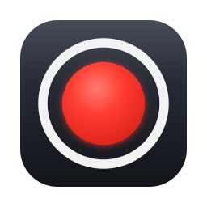

<p align="center">
  
</p>

# RecRec

A tiny menu-bar screen recorder for macOS that writes **small** MP4 files.

> **Em português:** RecRec é um gravador de tela para macOS que vive só na barra de menus (sem Dock, sem janelas) e gera arquivos MP4 **pequenos**: cerca de 2 MB por minuto de uso normal em tela Retina, contra 75–150 MB do QuickTime. Requer macOS 14+ e as Command Line Tools (`xcode-select --install`). Para rodar: `make run` (compila e abre o app). No primeiro uso, clique no ícone ● → **Start Recording**, autorize *Screen Recording* em Ajustes → Privacidade e Segurança, **feche e reabra o app** e grave. O atalho global é ⌃⌥⌘R; as gravações vão para `~/Movies/RecRec`. Todas as opções (microfone, áudio do sistema, qualidade, formato HEVC/H.264, fps, resolução, pasta) ficam no menu. As seções abaixo detalham build, permissões, tamanhos esperados e solução de problemas.

- Records the entire screen with ScreenCaptureKit and Apple's hardware HEVC/H.264 encoders. No windows, no Dock icon, no dependencies: the app bundle is about 550 KB and idles at ~44 MB of RAM.
- Files are 10–20× smaller than QuickTime's for the same content: constant-quality encoding, frames written only when the screen changes, HEVC by default, 30 fps. A minute of typical desktop work is around 2 MB at full Retina resolution (about 1 MB at 1x); QuickTime writes 75–150 MB for the same minute.
- Crash-safe: recordings are fragmented MP4/MOV, so a crash or forced quit loses at most the last 5 seconds.

## Requirements

macOS 14 (Sonoma) or newer, Apple Silicon or Intel. To build: Swift 5.9+ from Xcode or the Command Line Tools (`xcode-select --install`).

## Install

**Build from source (recommended, about a minute):**

```bash
git clone https://github.com/marcogbarcellos/recrec.git
cd recrec
make run
```

Requires macOS 14+ and the Xcode Command Line Tools (`xcode-select --install`). `make run` builds `dist/RecRec.app` and opens it; copy it to `/Applications` if you want it to stick around.

**Download a build:** grab `RecRec-<version>.zip` from the [Releases](https://github.com/marcogbarcellos/recrec/releases) page, unzip, move `RecRec.app` to `/Applications` and open it. The build is signed with a local certificate and not notarized (no paid Apple Developer account), so macOS blocks it the first time: right-click the app → **Open**, then System Settings → Privacy & Security → **Open Anyway**. Or clear the quarantine flag from a terminal:

```bash
xattr -d com.apple.quarantine /Applications/RecRec.app
```

## Build and run

```bash
make app        # builds dist/RecRec.app (release; signs with the local "RecRec Development" certificate if present)
make run        # builds and opens it
make test       # runs the test suite (custom harness; no Xcode needed)
make bench      # re-runs the encoder benchmark (see docs/benchmarks/encoder-benchmark.md)
make icon       # regenerates the app icon and README logo from tools/icon/make-icon.swift
make release    # zips the built app into dist/RecRec-<version>.zip
make install    # builds, copies the app to /Applications and relaunches it from there
```

Options: `make signing-cert` creates a self-signed "RecRec Development" certificate once so rebuilds keep their Screen Recording permission (see Troubleshooting); `make app SIGN="Apple Development: Your Name (TEAMID)"` uses a real identity instead; `make app UNIVERSAL=1` builds an arm64 + x86_64 binary. Copy `dist/RecRec.app` to `/Applications` if you want Launch at Login to survive rebuilds.

## First launch

1. Click the ● icon in the menu bar → **Start Recording** (or press ⌃⌥⌘R).
2. macOS asks for **Screen Recording** permission the first time. Allow RecRec under System Settings → Privacy & Security → Screen & System Audio Recording, then **quit and reopen RecRec** (macOS requires a relaunch after granting this permission).
3. Start again. The icon turns into a red `● 00:00` timer. Stop with the menu, the hotkey, or the system's own recording indicator in the menu bar.
4. The file is revealed in Finder (`~/Movies/RecRec` by default) and listed in the menu under **Last:** with Open, Reveal in Finder and Export GIF.

Turning on **Microphone** asks for the microphone permission. Saving to Desktop, Documents or Downloads makes macOS ask for folder access once; `~/Movies` does not.

## Menu

| Item | Default | Notes |
|---|---|---|
| Start / Stop Recording | ⌃⌥⌘R | Global hotkey, no Accessibility permission needed. |
| Microphone | off | Default input device, AAC 64 kbps mono. |
| System Audio | off | Driver-free via ScreenCaptureKit, AAC 128 kbps stereo. RecRec's own sounds are excluded. |
| Show Cursor | on | |
| Quality | Balanced | Small / Balanced / High map to constant-quality encoder settings tuned per codec and resolution. |
| Format | MP4 · HEVC | HEVC plays natively on Apple devices, in Chrome 107+, Firefox 134+ (Windows) / 136+ (macOS) and Edge; on Windows it still needs the HEVC Video Extensions and a GPU with an HEVC decoder. Pick MP4 · H.264 when the recipient's setup is unknown; MOV variants are for Apple-only workflows. |
| Frame Rate | 30 fps | 15 / 24 / 30 / 60. Frames are only written when the screen changes, so a static screen costs almost nothing at any setting. |
| Resolution | Retina | Standard (1x) roughly halves the file at the cost of Retina-sharp text. |
| Display | screen under the mouse | Shown only with more than one display; pin a specific one if you prefer. |
| Save to | Movies/RecRec | Desktop, Downloads, or any folder. |
| Reveal in Finder After Recording | on | |
| Launch at Login | off | |

When both Microphone and System Audio are on, the file gets two audio tracks (QuickTime plays both; some players pick the first). Mixing them into one track is on the list.

## Expected file sizes

Measured on a 3456×2234 display with the benchmark scenario (typing, scrolling, idle, mouse movement, window dragging), 60 seconds, no audio:

| Setting | 60 s | Per minute |
|---|---|---|
| QuickTime-like H.264 30 Mbps | 38.2 MB | 38 MB |
| RecRec Balanced, HEVC, Retina | 1.8 MB | 1.8 MB |
| RecRec Balanced, H.264, Retina | 2.6 MB | 2.6 MB |
| RecRec Balanced, HEVC, Standard 1x | 1.2 MB | 1.2 MB |
| RecRec Small, HEVC, Retina | 1.5 MB | 1.5 MB |
| RecRec High, HEVC, Retina | 3.3 MB | 3.3 MB |

A completely static screen costs about 0.1 MB per minute; full-screen video playback is the worst case at roughly 10–20 MB per minute (still 5–10× below QuickTime). Real desktops with photos or dark themes will differ; the relative savings hold. Details and the raw sweep: `docs/benchmarks/encoder-benchmark.md`.

## Why the files are small

1. **Constant quality instead of a bitrate.** The encoder spends bits only where the picture changes (`kVTCompressionPropertyKey_Quality`); QuickTime and most recorders target a fixed bitrate even when nothing moves.
2. **Idle frames are skipped.** ScreenCaptureKit reports unchanged frames; RecRec writes a frame only when something changed, plus one heartbeat frame every 2 s so every player agrees on the duration.
3. **HEVC with speed-priority off.** On Apple's hardware encoder this is both smaller and sharper than the default HEVC path, and ~35% smaller than H.264 at equal quality.
4. **Cheap keyframes.** Keyframes are spaced by frame count (10 s of written frames), so idle periods do not pay for a full-frame keyframe every few seconds.

## Troubleshooting

- **"Screen Recording permission needed" keeps coming back after rebuilding.** Ad-hoc signed builds have no stable identity, so macOS treats each rebuild as a new app. Either sign with a real identity (`make app SIGN="Apple Development: …"`, or a self-signed code-signing certificate created in Keychain Access) or reset the entry with `tccutil reset ScreenCapture com.barsmike.RecRec` and grant it again.
- **The recording stopped by itself.** Display disconnected, the Mac went to sleep, or Stop was pressed in the system indicator. The file up to that moment is finalized and listed under **Last:**.
- **H.264 on a 5K/6K display looks downscaled.** Apple's hardware H.264 encoder stops at 4096 px wide, so RecRec fits H.264 recordings inside 4096×2304. Use HEVC for full resolution.
- **Logs**: RecRec writes a diagnostics log to `~/Library/Logs/RecRec/RecRec.log` (one line per recording start/stop, microphone and encoder events, dropped-buffer counters). Attach it when reporting a problem. The same lines also go to the unified log (`log stream --predicate 'subsystem == "com.barsmike.RecRec"'`).

## Manual acceptance checklist

Things that need a human because they require the Screen Recording permission:

- [ ] First launch shows the permission flow; after relaunch, Start records and the timer counts.
- [ ] Stop via menu, via ⌃⌥⌘R, and via the system indicator all produce a playable file whose duration matches the wall clock.
- [ ] A recording with a static screen stays tiny; scrolling grows it moderately.
- [ ] Microphone on: voice is in sync with the video; System Audio on: app sound is captured, RecRec's own alerts are not.
- [ ] With two displays, "Screen under the mouse" records the right one; pinning a display works.
- [ ] Quit while recording finalizes the file; force-quit leaves a playable (fragmented) file missing at most 5 s.
- [ ] Export GIF produces a looping GIF next to the recording.
- [ ] Activity Monitor while recording: RecRec CPU well below one core.

## Project layout

```
Sources/RecRecCore/   settings, encoder configuration, frame gating, AVAssetWriter wrapper, naming, GIF export
Sources/RecRec/       AppKit menu-bar app: status menu, ScreenCaptureKit recorder, microphone, hotkey
Sources/RecRecTests/  test harness and tests (run with make test)
tools/encbench/       encoder benchmark used to choose the defaults
docs/                 design spec, implementation plan, benchmark results
```

## License

MIT.
